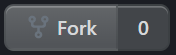
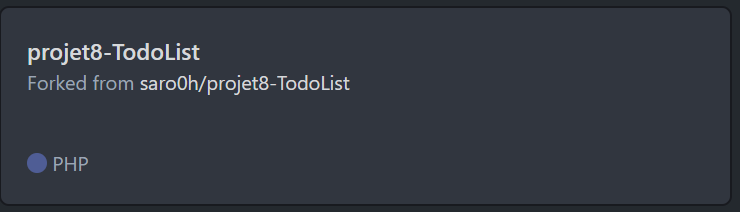

# How to contribute to this project?

## 1. Fork the project
For it, click on the fork button in GitHub. </br>

</br>
You will now have a copy of the repository on your own GitHub account. It will show like this:</br>

</br>
Copy this repository on your local machine:
```shell
git clone https://github.com/{your_github_username}/8-Todolist.git
```
Then go into the project's directory:
```shell
cd 8-TodoList
```
------------------------

## 2. Stay up to date
You need to set up a new remote that points to the original project to update your local copy with changes up to the original project.
```shell
git remote add upstream
```
So you will have two remotes: <br/>
. <code>origin</code> which points to the fork on your Github account. </br>
. <code>upstream</code> which points to the original project but you can only read, not write to this remote.

------------------------

## 3. Create a new branch
Be sure your up to date will the following code:
```shell
git checkout master
git pull upstream master && git push origin master
```
Create a new branch with an understandable name which explain what features you want to develop or the bug you want to fix.
```shell
git checkout -b {branch-name}
```

------------------------

## 4. Install the project
Follow all the step describe on the [installation insctructions](../README.md)

------------------------

## 5. Code !
Develop and work on the issue you choose. </br></br>
 Don't forget to lunch test to be sure you didn't broke anything ;). You can see all the tests command on the [tests section](../README.md). You may also add a new test to show that your change fixes the original problem.
</br></br>
Stay focus on the issue you're working on, don't fix others problems or create others features. It's better to create a new issue for each problem and new feature. 
</br></br>
Create good commit messages, explaining what you did in a short and clear description.

------------------------

## 6. Create a Pull Request
When your issue is finish you need to push your branch to te origin remote:
```shell
git push origin {branch-name}
```
Your branch is now available on your GitHub account.
Go to your online account with your browser on the project you will see the "Compare and pull request" button.

When you press the button you will see if there is error and conflicts. Solve them if they are some.
</br></br>
Set a clear title and a short description to explain what you did. Then click on the "Create pull request" button.
</br></br>
Now, wait. The admin of the project will review your request and will merge you work into the project if your work is good and relevant.
