# Audit de qualité

## Etat initial de l'application

### 1. Qualité du code
Rapport Code Climate

Dans le rapport Code Climate on peut voir quelques problèmes de duplication ou de code mal écrit mais rien de très long à changer.
  
Rapport Codacy

Sur Codacy on peut voir des problèmes de sécurité. Ce n'est pas surprenant car l'application est encore sous Symfony 3.1. C'est pourquoi j'ai mis à jour Symfony vers la version stable actuel: la 4.4.
On voit aussi quelques soucis de syntaxe de code, mais rien de bien préoccupant.

## Améliorations réalisés
### Upgrade vers Symfony 4.4 (version stable)
Pour commencer, j'ai mis à jour Symfony pour le passer de la version 3.1 à la dernière version stable: la 4.4. J'ai du modifier beaucoup de fichiers de configuration, et de bundles dépréciés. J'ai également refait toute l'architecture de fichiers afin qu'elle corresponde à l'architecture de la version 4.4.
 Arborescence initial sous 3.1 :

Arborescence après passage à la 4.4:

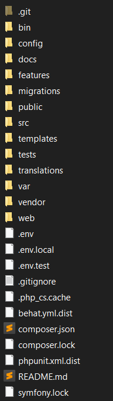

On peut voir en particulier que le dossier app disparaît sous la version 4.4 et le dossier config fait son apparition pour centraliser toutes les configurations de l'application. L'application est ainsi plus sûre car elle est à jour.

### Expérience utilisateur
J'ai pris l'initiative de modifier quelques détails de l'interface afin qu'elle soit plus lisible et agréable pour l'utilisateur.
 
Premièrement les boutons "Supprimer" et "Marquer non terminée" étaient collé dans la liste des tâches. Comme on peut le voir ci-dessous je les ai mis à l'opposé l'un de l'autre.

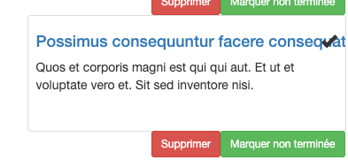
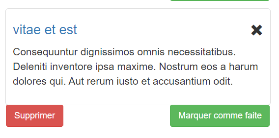

Ensuite j'ai vue que le bouton "Créer une tâche" décalait toute la dernière colonne de tâches, ce qui n'était pas très joli. J'ai donc remédié à ce problème.

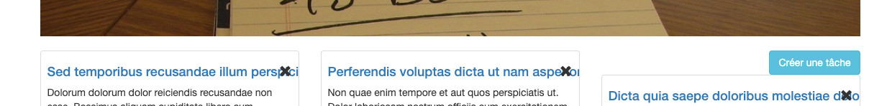
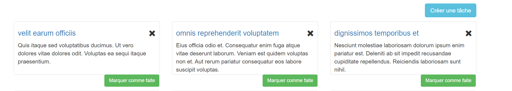

J'ai également créé un espace entre la bannière et les boutons "Créer un utilisateur" et "Se déconnecter" pour plus d'esthétisme.

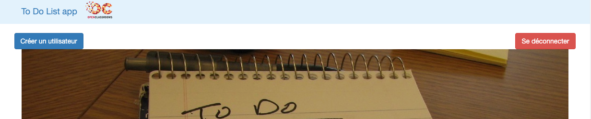
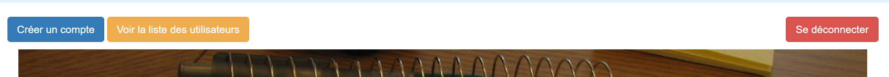

De plus j'ai créer une page pour afficher les tâches terminées afin que le bouton "Consulter la liste des tâches terminées" ne pointe plus dans le vide.  
Comme les tâches sont désormais lié à un utilisateur j'ai supprimé l'accès aux tâches par des personnes non connectés.

## Etat de l'application après amélioration
### 1. Qualité du code
Rapport Code Climate
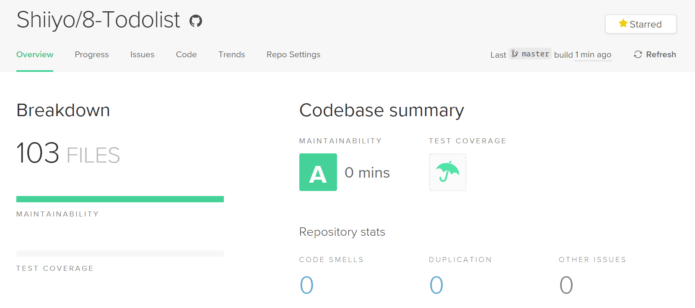
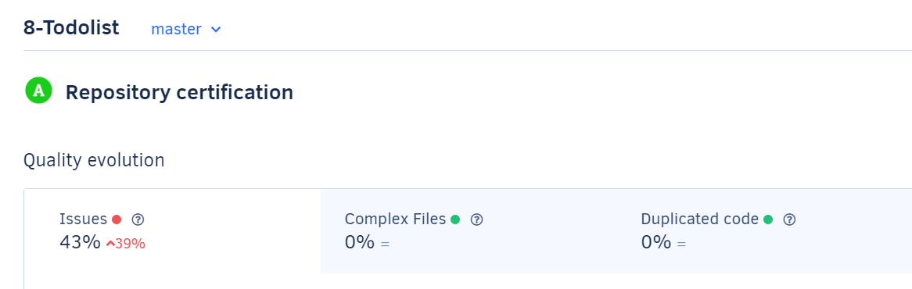
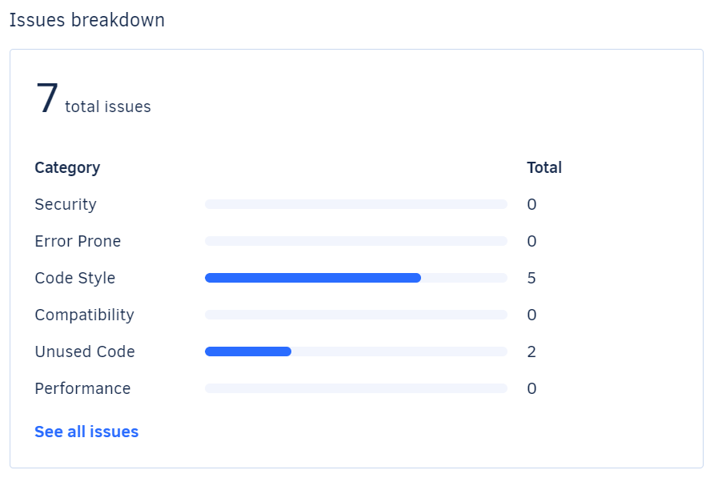
On peut voir qu'après le mise à jour vers Symfony 4.4 et quelques modifications mineurs du code, nous arrivons à avoir des badges A sur les deux sites avec très peu de problèmes de syntaxe restant. Ce sont de très bon résultat qui affirme une bonne qualité de code.

## Tests de l'application
### Tests unitaire avec PHP Unit

J'ai utilisé l'outil PHP Unit pour réaliser mes tests unitaires. Les tests unitaires servent à exécuter une méthode dont on maîtrise les points d'entrées et de vérifier que la sortie fonctionne correctement. C'est ce qu'on appelle des tests "boites blanches". J'ai ainsi testé les getters et setters des entités de l'application.

### Tests fonctionnels avec Behat
Pour les tests fonctionnels j'ai utilisé l'outil Behat:

Les tests fonctionnels, pour leur part, teste les pages, les formulaires, le clic d'un lien comme si un utilisateur le faisais à la main sur notre site. C'est ce qu'on appelle des tests "boites noires" car on n'a pas besoin de connaître le détail du code. J'utilise ces tests sur tout le reste de l'application car nous sommes ici sur une application de site web.

### Blackfire
J'ai effectué une analyse avec Blackfire à la réception de l'application puis après les mises à jour et modification effectué.
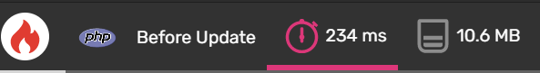

Les performances n'ont pas beaucoup évolué, le site s'est un peu alourdis par le passage à Symfony 4.4 mais il a gagné en sécurité ce qui n'est pas négligeable. Il reste performant car il se charge en moins de 3 sec.

### Conclusion des tests
On peut voir que la couverture de code de minimum 70% est ici respecté. Les tests couvre une partie majoritaire de l'application et vont permettre de savoir rapidement si un problème se déclare et où précisément pour le débuger rapidement. Il est important dans l'avenir de faire du Test Driven Developpement afin de pérenniser l'utilité des tests et leur couverture sur les futurs améliorations de l'application. Les tests Blackfire permettent de voir une continuité de performance malgré l'ajout de fonctionnalités et pourront servir de référence pour l'avenir du développement du site.

## Idées d'améliorations futures
### Cache
La mis en place d'un cache permettrait d'augmenter considérablement la vitesse d'affichage lors de l'actualisation d'une page. Il est possible de créer un cache valide dans un certain laps de temps donnée, c'est ce qu'on appelle le cache d'expiration. Il existe également un cache qui se met à jour si les données demandées ont changés, aussi appelé cache de validation. Les deux caches peuvent être implémenté car ils peuvent se compléter au besoin.

### CSS
Toujours dans l'optique d'améliorer les performances de l'application il pourrait être intéressant de nettoyer le CSS. On pourrait le réécrire sans utiliser Bootstrap car il est très lourd à charger et l'application n'utilise que très peu de ses fonctionnalités.

### Responsive
L'affichage responsive n'est pas optimal et la navigation n'est pas très aisé actuellement en mode téléphone ou tablette. Pour une expérience utilisateur plus agréable il serait intéressant d'améliorer cet aspect de l'application car beaucoup d'utilisateur n'ont pas d'ordinateur mais des tablettes et téléphones pour naviguer sur Internet.