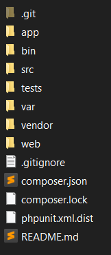
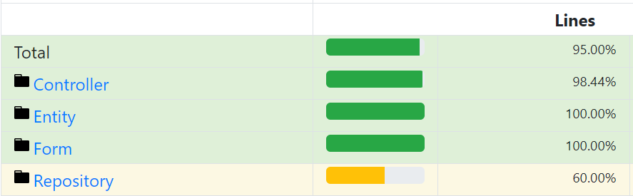

# Audit de qualité

## Etat initial de l'application

### 1. Qualité du code
Rapport Code Climate

On peut voir quelques problèmes de duplication ou de code mal écrit mais rien de très loin a améliorer.
 
Rapport Codacy

Sur Codacy on peut voir des problèmes de sécurité. Ce n'est pas surprenant car l'application est encore sous Symfony 3.1. C'est pourquoi j'ai mis à jour Symfony vers la version stable actuel 4.4.
On voit aussi quelques soucis de syntaxe de code, mais rien de bien préoccupant.

## Améliorations réalisés
### Upgrade vers Symfony 4.4 (version stable)
Pour commencer, j'ai mis à jour Symfony pour le passer de la version 3.1 à la dernière version stable: la 4.4. J'ai du modifier beaucoup de fichiers de configuration, et de bundles dépréciés. J'ai également refait toute l'architecture de fichiers afin qu'il corresponde à l'architecture de la version 4.4.
 Arborescence initial sous 3.1 :

Arborescence après passage à la 4.4:

On peut voir en particulier que le dossier app disparait sous la version 4.4 et le dossier config fait son apparition pour centraliser toutes les configurations de l'application. L'application est ainsi plus sûre car elle est à jour.

### Cache

### Expérience utilisateur

## Etat de l'application après amélioration
### 1. Qualité du code
Rapport Code Climate

On peut voir qu'après le mise à jour vers Symfony 4.4 et quelques modifications mineurs du code, nous arrivons à avoir des badges A sur les deux sites avec très peu de problèmes de syntaxe restant. Ce sont de très bon résultat qui affirme une bonne qualité de code.

## Tests de l'application
### Tests unitaire avec PHP Unit

J'ai utilisé l'outil PHP Unit pour réaliser mes tests unitaires. Les tests unitaires servent à exécuter une méthode dont on maîtrise les points d'entrées et de vérfier que la sortie fonctionne correctement. C'est ce qu'on appelle des tests "boites blanches". J'ai ainsi testé les getters et setters des entités de l'application.

### Tests fonctionnels avec Behat
Pour les tests fonctionnels j'ai utilisé l'outil Behat:

Les tests fonctionnels, pour leur part, teste les pages, les formulaires, le click d'un lien comme si un utilisateur le faisais à la main sur notre site. C'est ce qu'on appelle des tests "boites noires" car on n'a pas besoin de connaître le détail du code. J'utilise ces tests sur tout le reste de l'application car nous sommes ici sur une application de site web.

### Conclusion des tests
On peut voir que la couverture de code de minimum 70% est ici respecté. Les tests couvre une partie majoritaire de l'application et vont permettre de savoir rapidement si un problème se déclare et ou précisement pour le débuger rapidement. Il est important dans l'avenir de faire du Test Driven Developpement afin de péréniser l'utilité des tests et leur couverture sur les futurs améliorations de l'application.

## Idées d'améliorations futures
